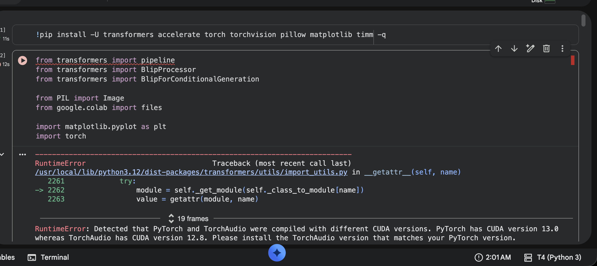
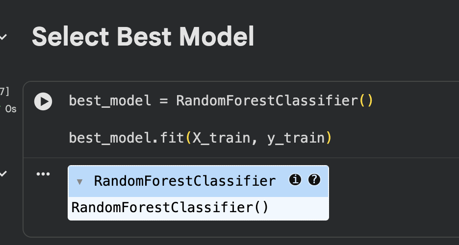
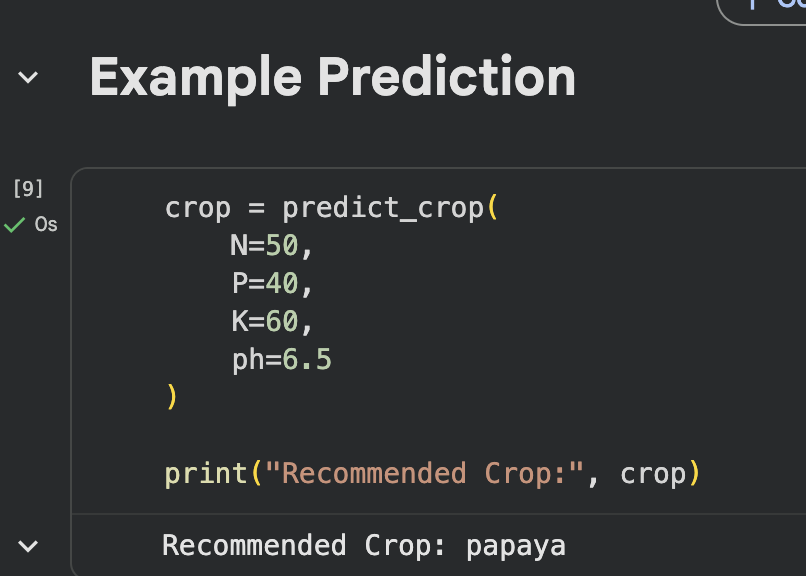

# 🌾 Agriculture Prediction System

A Machine Learning project that recommends the most suitable crop for cultivation based on soil nutrient analysis. Trained and compared 5 classification algorithms — selecting Random Forest as the best-performing model with **81.14% accuracy**.

🔗 **[View Notebook](Agriculture_Prediction_System.ipynb)**

---

## 📌 Problem Statement

Farmers often lack data-driven tools to determine which crop suits their soil conditions. This system takes soil nutrient readings as input and predicts the optimal crop — reducing guesswork and improving yield decisions.

## 📊 Dataset

| Feature | Description |
|---------|-------------|
| N | Nitrogen content in soil |
| P | Phosphorus content in soil |
| K | Potassium content in soil |
| pH | Soil pH level |
| **crop** | Target variable — crop type to recommend |

Source: `soil_measures.csv` (included in repo)

## 🤖 Model Comparison Results

| Model | Accuracy |
|-------|----------|
| Logistic Regression | 66.82% |
| Decision Tree | 38.18% |
| Naive Bayes | 77.50% |
| **Random Forest** | **81.14%** ✅ |
| SVM | 60.45% |

Random Forest selected as the final model based on highest test set accuracy.

## 📸 Results

### Model Accuracy Comparison

### Best Model Selection

### Example Prediction Output

## 🛠️ Tech Stack

- Python, scikit-learn, pandas, NumPy, Matplotlib, Seaborn
- Google Colab

## 📈 Project Workflow

1. Data Collection & Loading
2. Exploratory Data Analysis (EDA)
3. Feature Analysis & Correlation
4. Model Training — 5 algorithms compared
5. Model Evaluation (Accuracy, F1 Score, Classification Report)
6. Final Model Selection & Crop Prediction

## 📂 Repository Structure
